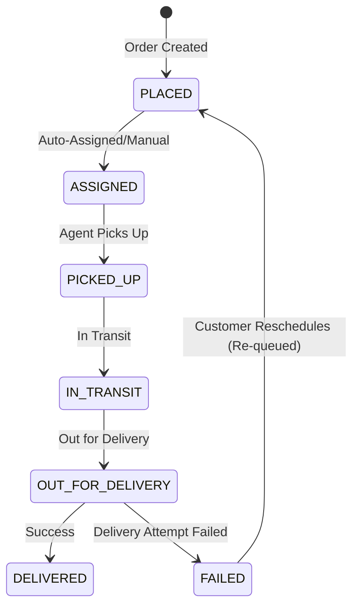

# System Design Write-Up: Last-Mile Delivery Tracker

This document presents the architectural choices and algorithmic designs implemented in the **Last-Mile Delivery Tracker** platform.

---

## 1. Rate Calculation Engine

Logistics billing demands absolute correctness, transparency, and auditability. The billing engine implements the standard industry formula:

$$\text{volumetric weight} = \frac{L \times B \times H}{5000}$$
$$\text{billable weight} = \max(\text{actual weight}, \text{volumetric weight})$$
$$\text{zone type} = \text{pickup zone} == \text{drop zone} ? \text{INTRA} : \text{INTER}$$
$$\text{base charge} = \text{base rate} + (\text{billable weight} \times \text{per-kg rate})$$
$$\text{final charge} = \text{base charge} + \text{COD surcharge (if payment type is COD)}$$

### Historical Rate Immutability
To solve the classic challenge where modifications to active rate cards inadvertently recalculate historical order costs, this engine employs two distinct design patterns:
1. **JSON Snapshotting**: At the exact moment of order confirmation, the complete calculation breakdown (including inputs, volumetric calculation, rate card ID, applied base rate, and per-kg rate) is stored as a serialized JSON snapshot directly in the `Order.chargeBreakdown` column. 
2. **Temporal Versioning**: Rather than overwriting rates, `RateCard` schema utilizes `effectiveFrom` and `effectiveTo` timestamps. When calculating price, the system queries the active card satisfying $\text{effectiveFrom} \le \text{now} \le \text{effectiveTo}$.

---

## 2. Zone Detection Approach

To identify pickup and drop locations, the platform uses an **Area Pincode-to-Zone mapping**. 
- Pincodes (e.g., `560001`) are mapped to unique administrative zones (e.g., `Zone 1 - Central Bangalore`) in the `AreaZoneMapping` table.
- When an order is created, the system performs a primary key lookup for the pickup and drop pincodes.
- If $\text{pickupMapping.zoneId} == \text{dropMapping.zoneId}$, the shipment type is classified as **Intra-Zone** (local delivery); otherwise, it is classified as **Inter-Zone** (cross-town transport), triggering the corresponding rate card policies.

*Note on Scalability*: While the pincode mapping is highly performant and deterministic, it can be extended to spatial polygon indexing using PostGIS (`ST_Contains`) in Postgres, allowing administrators to draw delivery boundary polygons on Leaflet.js maps.

---

## 3. Auto-Assignment Logic

The auto-dispatch algorithm balances delivery speed (proximity) with network capacity (load balancing).

### Algorithm & Scoring
For an order, candidate agents are filtered:
1. Status is `AVAILABLE` (online and accepting orders).
2. Covering the order's pickup zone (check coverage array).
3. Under capacity threshold: $\text{activeCount} < \text{maxConcurrent}$.

The system calculates a load-balanced dispatch score for each eligible agent:

$$\text{score} = \text{Haversine Distance} \times \text{Load Factor}$$
$$\text{Load Factor} = 1 + \frac{\text{activeCount}}{\text{maxConcurrent}}$$

Where Haversine distance is calculated using Earth's radius ($6371\text{ km}$) and geodetic coordinate differences. This load factor prevents bottlenecking a single close agent and spreads orders across the network.

### Race Condition Mitigation
In high-frequency dispatch environments, multiple orders might concurrently select and assign the same agent. To enforce concurrency safety:
- The assignment is wrapped in a database **transaction** (`prisma.$transaction`).
- For PostgreSQL deployment, raw row-locking is enforced via `SELECT ... FOR UPDATE` on the selected agent row, blocking concurrent threads from reading/writing to the same agent until the transaction completes and the agent's capacity updates.

---

## 4. Failed Delivery & Reschedule Flow

Delivery failures are common in last-mile logistics (e.g., customer unavailable). 

### Lifecycle State Machine

1. **Attempt Recording**: When an agent marks a shipment as `FAILED`, the status is written to the append-only `OrderStatusHistory` table along with a mandatory reason note. The agent's current active count is decremented, releasing their capacity.
2. **Reschedule capture**: The order is locked in the `FAILED` state. The customer receives an email notification containing a rescheduling link.
3. **Re-routing**: Upon submitting a new target delivery date via a `RescheduleRequest`, the order's status resets to `PLACED`, its assigned `agentId` is wiped, and the system triggers auto-assignment to find an available agent for the next attempt.
